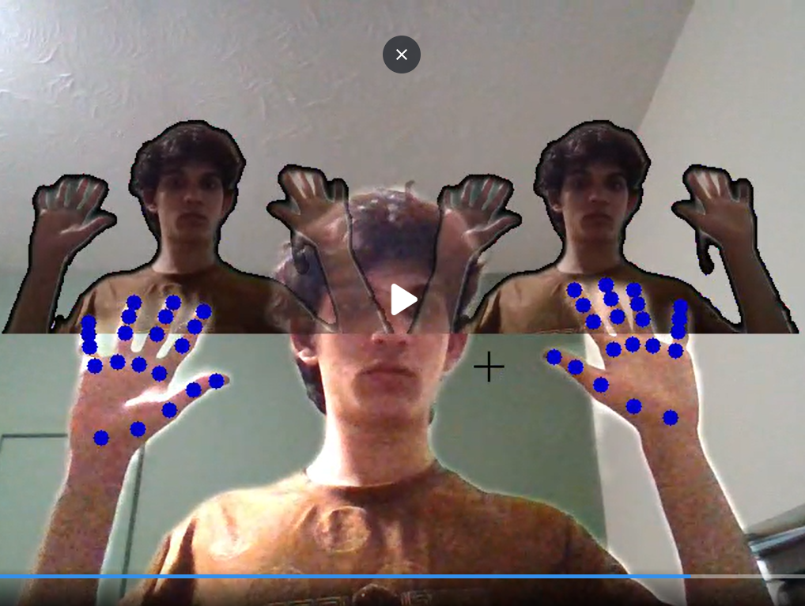

# 🍥 Real-Time Shadow Clone Jutsu (Kage Bunshin)

⚠️ **STATUS: WORK IN PROGRESS**

This project is currently under active development. Features and visual effects are being refined daily.

A real-time Augmented Reality (AR) application that detects specific Naruto hand signs and triggers visual effects on the webcam feed. Currently implements the **Shadow Clone Jutsu (Kage Bunshin)**, generating clones of the user in real-time using body segmentation and computer vision.

---

## 📸 Demo (Current Prototype)

---

## ✨ Features

- **Hand Sign Detection**  
  Uses MediaPipe Hands to track 21 landmarks per hand.

- **Jutsu Trigger**  
  Detects the **"Ram" (Hitsuji) seal** — the specific crossed-finger gesture used for Shadow Clones.

- **Real-Time Segmentation**  
  Uses AI to separate the user from the background (no green screen required).

- **Visual Effects**  
  Instantly generates *Shadow Clones* that mimic the user's movements when the Jutsu is activated.

- **State Management**  
  Includes cooldowns and duration timers for effects.

---

## 🛠️ Tech Stack

- **Python** – Core logic  
- **OpenCV (cv2)** – Image processing, alpha blending, and overlay logic  
- **MediaPipe**
  - Hands Module – Landmark detection and gesture recognition  
  - Selfie Segmentation – Extracting the user's body from the background  
- **NumPy** – High-performance matrix operations for masking and image manipulation  

---

## 🤝 Contributing
    This is a personal learning project for Computer Vision and AI engineering. Suggestions for optimization (especially FPS improvements) are welcome!